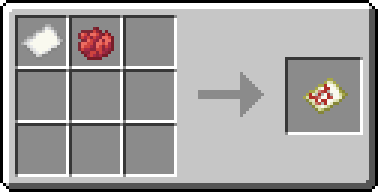

# 

A Minecraft plugin for Spigot/Paper/Purpur which adds ticket based filtering for detector rails. This enables the creation of advanced minecart routing systems.

Minecart Routing is entirely server-side, clients don't need to install anything for the plugin to function.

## Usage

Minecart Routing uses 'tickets' to determine if a detector rail should be activated or not. A different ticket for each dye can be crafted by combinding it with paper in a crafting table.

Dectector rails can have a filter set by right-clicking them with a dye. This will cause them to only activate when a minecart with the corresponding ticket in it or any of its passenger's inventories passes over it.

Filtered detector rails can also be inverted, so that they only activate with any ticket OTHER than its color.
